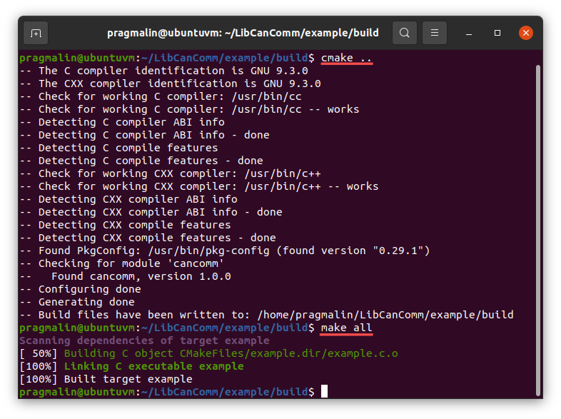
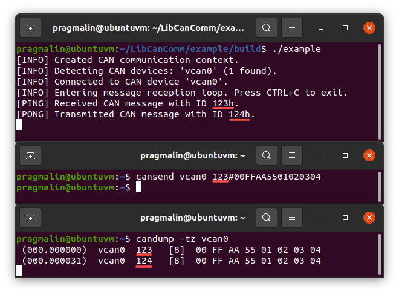

The `example/` subdirectory contains an example application that you can use. Both as a reference and as a template for developing your own CAN enabled application. This section covers how to build the example application and how you can test that it works. It is assumed that you already configured and enabled a SocketCAN device on your Linux system. Refer to the section on [how to bring up a SocketCAN device](index.md#bring-up-a-socketcan-device) for more info.

The example application leverages CMake to automatically generate the build environment. However, this is not a requirement for building your own application, based on LibCanComm. Refer to [this tutorial](https://www.pragmaticlinux.com/2022/03/how-to-link-a-shared-library-with-gcc-and-cmake/) for details on how to properly link a shared library, such as LibCanComm, to your own C or C++ application.

## Building the example application

This section shows you how to build the example application directly from the terminal. When you develop your own CAN enabled application, you probably want to opt for a graphical development environment along the lines of Visual Studio Code, as described in this tutorial:

* [Import a CMake project into Visual Studio Code](https://www.pragmaticlinux.com/2021/07/import-a-cmake-project-into-visual-studio-code/)

To build the example application using the terminal, open up your terminal and change into directory `example/build/`. Next, generate the build environment and continue with building the application:

* `cd ~/LibCanComm/example/build`
* `cmake ..`
* `make all`

Once the build operation completes, you can find the `example` executable in the `~/LibCanComm/example/build` directory.

## Install can-utils

Before we take the example application for a spin, let's first install the `can-utils` package on our Linux system. It includes the utilities `cansend` and `candump` for sending and logging CAN messages, respectively. The installation instructions for popular Linux distributions:

- Ubuntu/Debian: `sudo apt install can-utils`
- Fedora: `sudo dnf install can-utils`
- openSUSE: `sudo zypper install canutils`

## Running the example application

The example application connects to the first SocketCAN network device found on your Linux system. Once connected, it enters its program loop to poll for the reception of CAN messages. Upon reception of a CAN message, it increments the CAN identifier and sends the message back onto the CAN bus. 

Assuming that your terminal is still opened in directory `example/build/`, you start the example application with command:

* `./example`

To test that it works, open up another terminal screen and send a CAN message using the `cansend` utility:

* `cansend vcan0 123#00FFAA5501020304`

The following screenshots assumes your SocketCAN device is called `vcan0`. The top terminal screen runs the example application, the middle one is used to send a CAN message and the bottom one shows all CAN message activity:

To exit the example application, press <kbd>CTRL</kbd>+<kbd>C</kbd>.