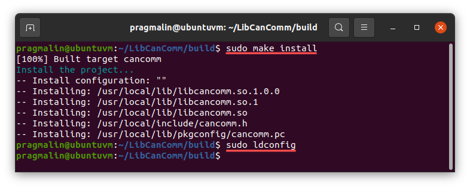

**LibCanComm** is a Linux shared library for CAN communication. Its goal is to make it easier for application developers to access and exchange data with nodes on a CAN bus. The library supports both CAN classic and CAN FD message formats. **LibCanComm** embeds functionality for:

* Listing the available SocketCAN devices on the user's system.
* Connecting to a SocketCAN device.
* Transmitting and receiving CAN messages.

The library itself is developed in the C programming language. While designing the library's API, special care was taken to make it uncomplicated to create bindings for other programming languages. As such, it should be straightforward to access the **LibCanComm** shared library from different programming languages, such as Python, Java, C#, Rust, Go, Ruby, Object Pascal, etc.

Note that **LibCanComm** does not provide functionality related to configuring and bringing up SocketCAN devices on the user's system. The excellent [LibSocketCan](https://git.pengutronix.de/cgit/tools/libsocketcan) library already covers this, if you want to perform these tasks programmatically. Although most users tend to handle this manually themselves with calls to `ip link` or automate it with the help of `systemd-networkd`.

## Installation instructions

This section presents step-by-step instruction for downloading, building and installing **LibCanComm** onto your Linux system.

### Install build dependencies

To download, build and install **LibCanComm** onto your Linux system, you just need C development and Git related package on your system. The installation instructions for popular Linux distributions:

* Debian / Ubuntu / Raspberry PI OS: `sudo apt install git gcc g++ gdb make cmake`
* Fedora: `sudo dnf install git gcc g++ gdb make cmake`
* openSUSE: `sudo zypper install git gcc gcc-c++ gdb make cmake`

### Download the code

To obtain the code, you can either download the latest stable release from the GitHub repository:

* [https://github.com/pragmaticlinuxblog/cancomm/releases](https://github.com/pragmaticlinuxblog/cancomm/releases)

Or directly clone the latest development version:

* `git clone https://github.com/pragmaticlinuxblog/cancomm.git ~/LibCanComm`

It's recommended to stick with a stable release. The following sections assume that you either cloned or extracted the code to directory `~/LibCanComm`.

### Generate the build environment

After downloading the code, you can automatically generate the build environment with the help of CMake. Open your terminal, go to the `build` subdirectory and run the `cmake ..`command:

* `cd ~/LibCanComm/build`
* `cmake ..`


### Build the library

With the build environment generated, you can continue with building the shared library. Run this command:

* `make all`


### Install the library

As a final step, you install the shared library onto your system and run `ldconfig` to register it:

* `sudo make install`
* `sudo ldconfig`



## Bring up a SocketCAN device

Before your application can communicate with other nodes on the CAN bus, you need to connect a CAN adapter supported by the Linux kernel's SocketCAN subsystem. For example a [Peak PCAN-USB](https://www.peak-system.com/PCAN-USB.199.0.html?&L=1) or a [Kvaser LeafLight](https://www.kvaser.com/product/kvaser-leaf-light-hs-v2/).  Once connected, it shows up as a SocketCAN device on your PC. By default, the SocketCAN device is not yet configured and brought in the *UP* state. The following tutorials explain in details how to perform these tasks. Note that if you don't have access to a CAN adapter, you can continue with a virtual SocketCAN device.

* [How to create a virtual CAN interface on Linux](https://www.pragmaticlinux.com/2021/10/how-to-create-a-virtual-can-interface-on-linux/)
* [Automatically bring up a SocketCAN interface on boot](https://www.pragmaticlinux.com/2021/07/automatically-bring-up-a-socketcan-interface-on-boot/)
* [CAN communication on the Raspberry PI with SocketCAN](https://www.pragmaticlinux.com/2021/10/can-communication-on-the-raspberry-pi-with-socketcan/)

## Code sample

This section presents a few brief code samples to give you an idea of how you use **LibCanComm** in your own application. For more information refer to the [example application](example.md) and the [API reference](api.md).

```c linenums="1" title="Listing all available SocketCAN devices:"
#include <cancomm.h>
#include <stdio.h>

int main(void)
{
  cancomm_t canCommCtx;
  uint32_t  canDeviceCnt;
  uint32_t  canDeviceIdx;
    
  /* Create a new context. */
  canCommCtx = cancomm_new(); 
    
  /* List all SocketCAN devices found on the system. */
  canDeviceCnt = cancomm_devices_buildlist(canCommCtx);
  for (canDeviceIdx = 0; canDeviceIdx < canDeviceCnt; canDeviceIdx++)
  {
    printf("%s\n", cancomm_devices_name(canCommCtx, canDeviceIdx));
  }
    
  /* Release the context. */
  cancomm_free(canCommCtx);
}
```

```c linenums="1" title="Connecting to a SocketCAN device and transmitting a CAN message:"
#include <cancomm.h>

int main(void)
{
  cancomm_t canCommCtx;
  uint32_t  canId = 0x123;
  uint8_t   canExt = CANCOMM_FALSE; /* 11-bit identifier */
  uint8_t   canData[] = { 0x01, 0x02, 0x55, 0xAA };
  uint8_t   canFlags = 0; /* classic CAN. */
  uint64_t  canTimestamp = 0;
    
  /* Create a new context. */
  canCommCtx = cancomm_new(); 
 
  /* Connect to SocketCAN device "vcan0". */
  cancomm_connect(canCommCtx, "vcan0");
    
  /* Transmit the CAN message. */
  cancomm_transmit(canCommCtx, canId, canExt, 4, canData, canFlags, &canTimestamp);
    
  /* Release the context. */
  cancomm_free(canCommCtx);
}
```

## License

[](https://www.gnu.org/licenses/old-licenses/lgpl-2.1.html)
